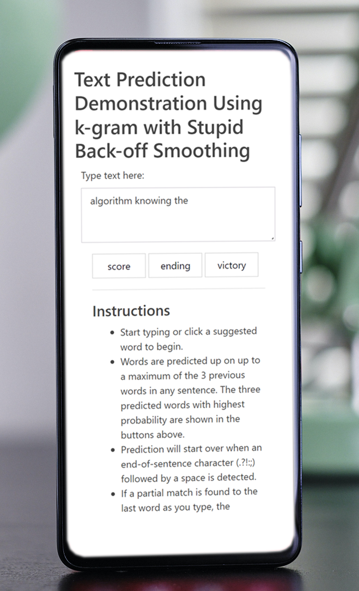

```{r setup, include=FALSE}
knitr::opts_chunk$set(echo = FALSE)
```

------------------------------------------------------------------------

```{=html}
<div class="row">
  <div class="column left" style="width: 35%;">
```
{width="90%"}

```{=html}
  </div>
  <div class="column right" style="width: 65%;">
```
<h2>Rapid Lightweight Text Prediction Engine</h2>

-   Easy to use
-   Rapid response times of only 20 milliseconds on large datasets
-   Custom dictionaries allow you to deploy your app with specialised terminology
-   Multi-lingual capability
-   Quick and easy to deploy in multiple languages
-   Auto suggestion as you type
-   Adaptable to multiple platforms (server to mobile)

```{=html}
  </div>
</div>
```

------------------------------------------------------------------------

<h1>Applications</h1>

<h2>As a natural language word predictor</h2>

-   Deploy to your web forms and reports for rapid data entry with commonly used and specialised terms relevant to the field and environment.
-   Quickly switch between languages.

<h2>As a sequence predictor</h2>

-   Use in large and seemingly chaotic environments to predict sequences of events.
-   In situations where hundreds or even thousands of event types can occur in seemingly random order, identify the next probable sequences given a previous set of outcomes.

<h2>As a behavioural modeller</h2>

-   Detect customer behaviour based on a pattern of outcomes
-   Look for unusual behaviour when an event is outside of the *n* most likely events to have occurred next. This has strong possibilities for use in fraud monitoring or mechanical failure surveillance.

------------------------------------------------------------------------

<h1>About the Demo</h1>

-   The model was trained on 100,000 sentences scraped from news, blog and twitter sources.
-   The vocabulary was built from a comprehensive US English dictionary and comprises of 49,271 word definitions) with 68% of dictionary words captured in the model.
-   On test runs of 10,000 predictions, average response time was 20.3 milliseconds with 67.8% accuracy (0.1% uncertainty). The demo model uses 135MB memory. By reducing the sentence count to 5000, this could be reduced 23MB while still retaining 55% accuracy.

The model uses an implementation of the "Stupid Backoff" algorithm which can be described as follows:

<h6>*Assume you're using 4-grams to calculate the probability of a word in a text "Today I'll go," followed by "hiking".*</h6>

<h6>*Suppose that "hiking" didn't occur in the context of "Today I'll go" in the training corpus and thus "hiking" has a zero probability for the 4-grams model. This is undesirable since we know that "hiking" is more likely than, say, "refrigerator".* </h6>

<h6>*To calculate the probabilities, the back-off process iterates through n-1 gram levels. A 3-gram model is used in this case to calculate the likelihood of "hiking" in the context "Today I'll go".*</h6>

<h6>*When using the "stupid backoff" algorithm, you multiply the odds by a lambda value every time you go back one level. So, if "hiking" exists in the 3-gram model, the probability is lambda \* P. ("hiking"\|"I'll go"). It's a much simpler algorithm than many other back-off algorithms requiring less computational overheads while retaining a good degree of accuracy.*</h6>

This model is built with a lambda value of 0.3.

------------------------------------------------------------------------

<h1>Running the Demo</h1>

-   Open the [online demo](https://fmytyz-richard-allen.shinyapps.io/Text-Predictor/){target="_blank"}.
-   Start typing or click a suggested word to begin.
-   Words are predicted up on up to a maximum of the 3 previous words in any sentence. The three predicted words with highest probability are shown in the buttons below the input.
-   Prediction will start over when an end-of-sentence character (.?!:;) followed by a space is detected.
-   If a partial match is found to the last word as you type, the suggested words will update with those matches. If there are less than three matches, the remaining words will be made up from most probable default predictions for the previous three words.
-   Due to memory constraints during model training, the match list is limited to 30 words.
-   When no matches are found for a partially typed word, the suggested words will revert to most probable predicted values for the previous three completed words.
-   Click a word to add it to the text input. When the last character is a space, it will be appended to the input, otherwise the last word is considered to be a partial word and replaced by the clicked suggested word.
-   Due to limitations of the demo, the prediction will always be on the end of the input rather than the cursor position. Clicking on a suggested word will add it to the end of the input only.
